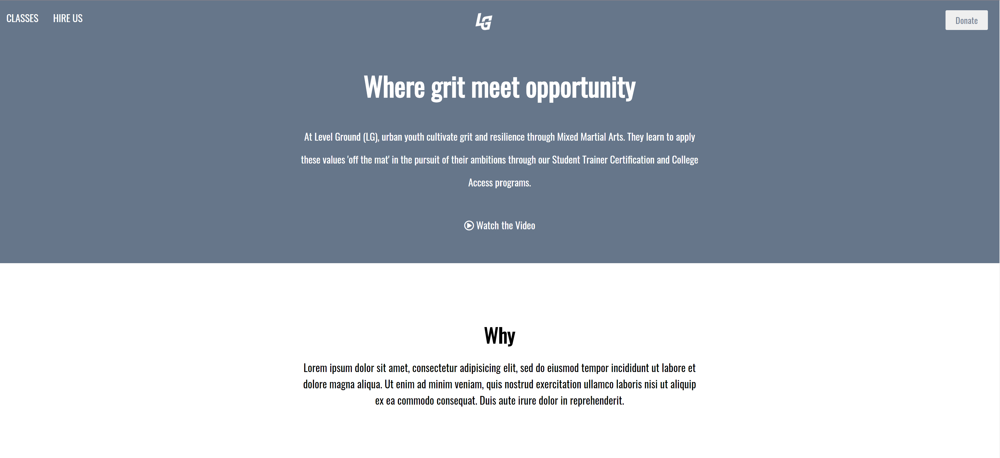

# Level-Ground Replica

Live Code: https://kimflores-levelground.netlify.app

# How It's Made:
### Tech used: 
My task was to replicate the Level Ground homepage with **HTML** and **CSS**. I was given a screenshot as reference and implemented media queries for responsiveness. 

# Lessons Learned:
One of the more straightforward sites that taught me how content should be made responsive to maintain a streamline appearance. Applying the "Mobile First" principle to the wireframe showed me that less is more, specifically in the footer and classes section. 

# Examples:
Take a look at these couple examples that I have in my own portfolio:

BBC: https://github.com/Kim-Flores/BBC

Yelp: https://github.com/Kim-Flores/Yelp

Venture Beat: https://kimflores-venturebeat.netlify.app

JWLI: https://github.com/Kim-Flores/JWLI
